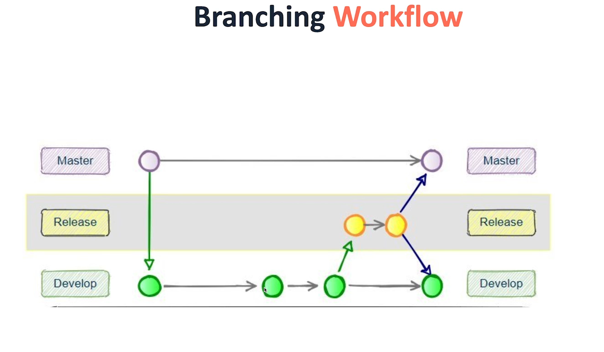

why branching is a good thing
purpose of branches 
branching workflow

-allowes developers to work on different features at the same time wthout affecting the main or prod env.
-you and test or merge before merging to main branch
-experiment with new ideas in a safe space 

Pull Requests 
Review code before integrating 
Keeps a Record
Maintain a High Code Quality
Assign Team Members 

Sometimes it takes another pair of eyes to see your mistakes 

